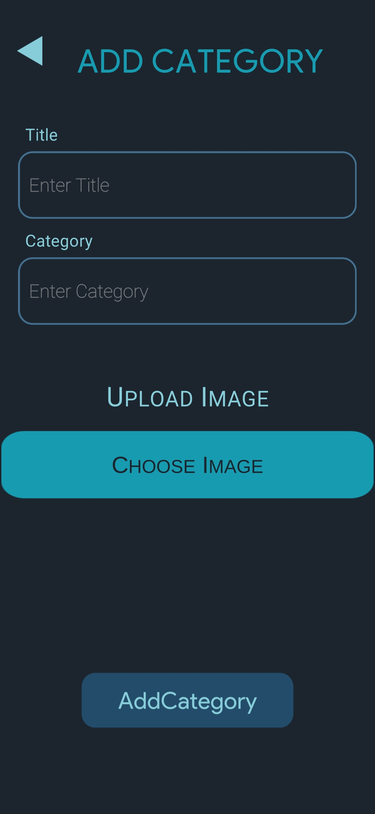
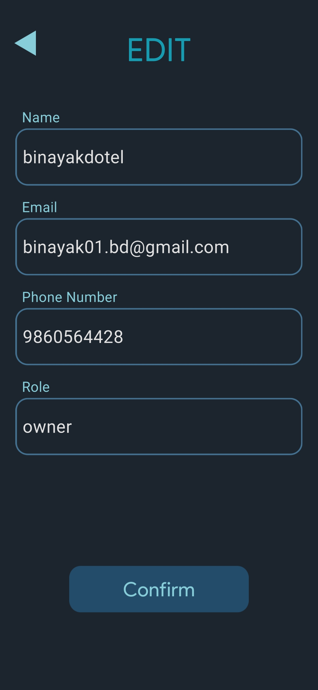

# ArtCollectionApp
This is the python Flask backend enables the user to interact with data. 
It contains functionality:
  <li>Register and Login </li> 
  <li>Add new category(Art) along with its title, category and image</li> 
  <li>Edit User Data </li> 
  <li>Edit the category title and category name (Allowed to only the author of the category)</li> 

API:  
url :- api/users/   
for logging in to the system: 
  -> Parameters: 
      -email: This is the email address of the registerd user. 
      -password: This is the password of the email address.  
   
  -> eg payload: 
    { 
      "email": "your email", 
      "password": "your password" 
    }  
   
   -> eg Response: 
     if success: 
      { 
        "email": "your email", 
        "name": "your name", 
        "phone_number": "number", 
        "role": "admin", 
        "status": "success", 
        "userid": "Id of the logged in user" 
      }  
      if error: 
      { 
        "status": "error" 
      } 
  
 # Screenshot
 
 <b>Login and Register screen</b>
 

  
  

  

<b>Home Screen</b>  
This is the HomePage where all the arts from the database are retreived from the database and displayed. 
Response Format:{ 
  "userid": "ID of the user who uploaded the Art", 
  "categoryid": "CategoryId of the Art", 
  "title" : "Name of Art", 
  "category": "Brief description of Art", 
  "rating" : "Rating of the Art", 
  "author_name": "Name of author who uploaded the Art", 
}  

  

  

  

  

  

  
